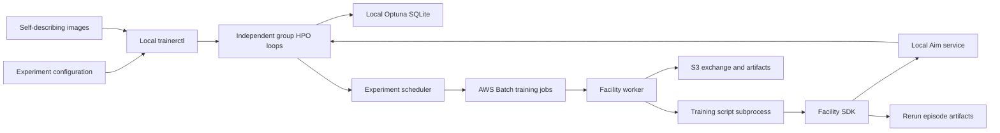

# Lightweight Training Infrastructure Design

## Purpose

Build a lightweight, modular training facility under `rtrrl/infra` that is
independent of any particular learning algorithm. A user supplies one experiment
configuration and one or more self-describing training images, then invokes one
local command. The facility performs all HPO iterations, AWS Batch execution,
Aim result collection, and Rerun artifact handling without requiring the user to
understand Optuna, Aim storage, S3 keys, or Batch job definitions.

## Scope

This master specification fixes the cross-system boundaries and delegates
detailed behavior to three sub-specifications:

- [Training Control Plane](2026-07-20-training-control-plane-design.md)
- [Training Observability SDK](2026-07-20-training-observability-sdk-design.md)
- [AWS Batch Migration](2026-07-20-aws-batch-migration-design.md)

The first release does not provide HPO recovery after controller/database loss,
multiple concurrent controllers, cross-experiment history import, shared sample
spaces, multi-seed HPO objectives, or automatic instance-type selection.

## Architecture

The control and observation facilities run on the local controller host. AWS
Batch runs training only.

### User responsibilities

- Supply a required readable experiment name and optional description.
- Organize independent optimization groups explicitly in the experiment YAML.
- Select an image, script, budgets, parameter policy, resources, and packing
  size for every group, using experiment defaults where appropriate.
- Build images containing the scripts, dependencies, facility worker, facility
  SDK, and script-bound field descriptions.
- Invoke `trainerctl run <experiment.yaml>` once.

### Facility responsibilities

- Resolve image tags to immutable digests and load the script descriptions
  bound to those digests.
- Resolve defaults and group-specific overrides into complete immutable group
  and run snapshots.
- Validate field names, basic types, search domains, budgets, resource profiles,
  and argv launch commands before submission.
- Create one isolated Optuna study for each explicit configuration group.
- Run each group’s ask/execute/collect/tell loop independently until its budget
  is exhausted.
- Pack execution-compatible runs into parallel Batch jobs whose worker executes
  child scripts serially.
- Provide the SDK that records structured Aim data, episode summaries, Rerun
  episodes, and checkpoint registrations.
- Hide infrastructure identifiers and storage layouts during normal use while
  retaining them for audit output.

## Experiment and Optimization Identity

The top-level experiment is the user-visible comparison boundary. Its exact
`experiment.name` becomes the Aim experiment name for every run.

Each named item under `groups` is an independent optimization unit. The
facility does not infer equivalence from script names, algorithm families,
parameter overlap, or fixed values. Two groups using the same script still get
different studies, budgets, run sequences, and Aim grouping metadata.

Run names are generated as `<group>-<four-digit-number>`. Filterable identity is
stored as structured Aim hparams, not parsed from the run name.

## Configuration Principles

Configuration is resolved in this order:

1. Script-bound runtime defaults.
2. Experiment-level `defaults`.
3. Group fields.
4. Group `overrides`.

Environment, training budget, logging cadence, resources, HPO settings,
execution settings, and metadata merge recursively. A group-level
`parameters.<field>` replaces the complete inherited parameter domain; partial
range inheritance is forbidden.

Script descriptions distinguish:

- `default`: the runtime value when a field is fixed and omitted.
- `constraints`: only genuine mathematical or interface requirements.
- `default_search`: a finite suggested search domain, not a hard boundary.
- `searchable`: whether the field may enter HPO.

The default `scan_unfixed` policy searches every searchable field that was not
fixed to one value. The optional `explicit_scan` policy fixes omitted fields and
searches only fields whose experiment domain contains multiple values or a
continuous range. Experiment domains replace `default_search` and may extend
beyond it while respecting genuine constraints.

## Automatic Execution

One foreground `trainerctl run` invocation owns all group state machines.
Groups advance independently: a fast group may begin its next HPO batch without
waiting for a slower group. The experiment scheduler may pack ready runs from
different groups or scripts together only when image digest, resource profile,
and `runs_per_job` match.

One HPO trial produces one concrete config, one logical training run, and one
Aim run. Batch retries create execution attempts for the same run and trial;
they never consume a new trial number.

The facility retries infrastructure failures at most twice by default.
Algorithm failures are not retried by default. Both limits are non-negative
group-overridable execution settings. Exhausted algorithm failures consume the
trial budget. Persistent controller, permission, or infrastructure failures
terminate the single command with a structured report; there is no resume
command in the first release.

## Data Responsibilities

- Optuna SQLite owns current-command study and trial state.
- AWS Batch owns job execution state.
- Aim is the user-facing source for run parameters and metrics and the source
  from which HPO objective values are collected.
- S3 exchanges concrete configs, job bundles, completion markers, checkpoints,
  Aim buffers, and Rerun artifacts.

No component is described as a global truth source. The controller reconciles
each source only within its defined responsibility.

## Fixed Compute Profiles

The facility reuses and strictly validates two existing profiles:

- CPU: `rtrrl-cpu-c7am-queue`, `c7a.medium`, 1 vCPU, 1600 MiB, 0 GPU.
- GPU: `rtrrl-gpu-g6x-queue`, `g6.xlarge`, 4 vCPU, 12000 MiB, 1 full NVIDIA L4.

`trainerctl run` never creates, updates, expands, or changes a queue or compute
environment. A mismatch fails before submission.

## Acceptance

Acceptance requires:

- Contract tests for defaults, overrides, parameter policies, identities, and
  fixed-resource validation.
- Controller integration tests with multiple independent groups and automatic
  `2+2+1` HPO batches.
- Docker smoke with at least two scripts, mixed groups, serial child processes,
  failure continuation, Aim buffering, and complete Rerun episodes.
- Explicitly authorized AWS smoke with parallel jobs and serial runs on the
  fixed CPU/GPU profiles.
- Verification of Aim experiment/group metadata, mandatory episode summaries,
  objective collection, Rerun naming, S3 marker contents, and CloudWatch timing.
- Removal of smoke data from Aim, S3, temporary image tags, and cleanable logs
  before declaring success.
- Safe deletion of only the superseded `rtrrl-cpu-queue` and
  `rtrrl-gpu-queue` after the new profiles pass and the old queues contain no
  nonterminal jobs.

User-facing documentation is part of acceptance: experiment YAML reference,
script-description authoring, SDK quick start and API, Aim/Rerun lookup, the
single-command lifecycle, failure semantics, and smoke/cleanup operations.
